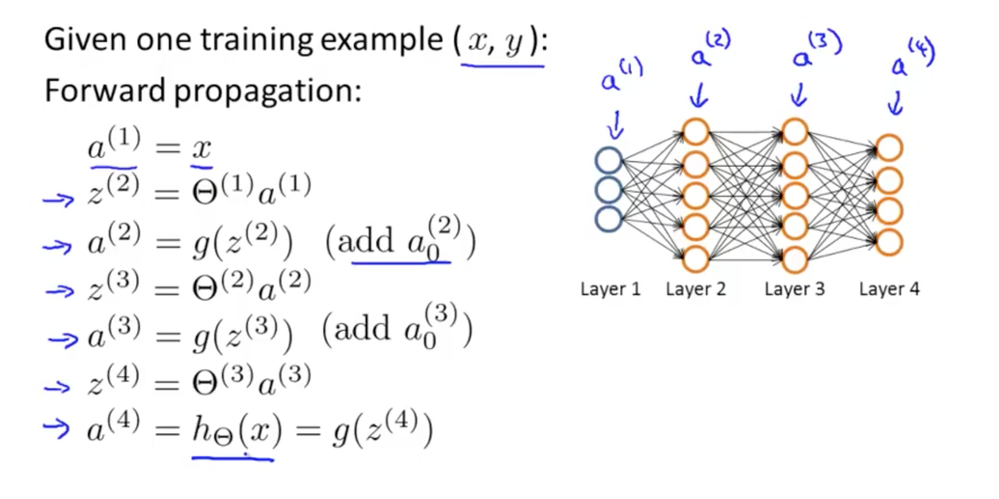
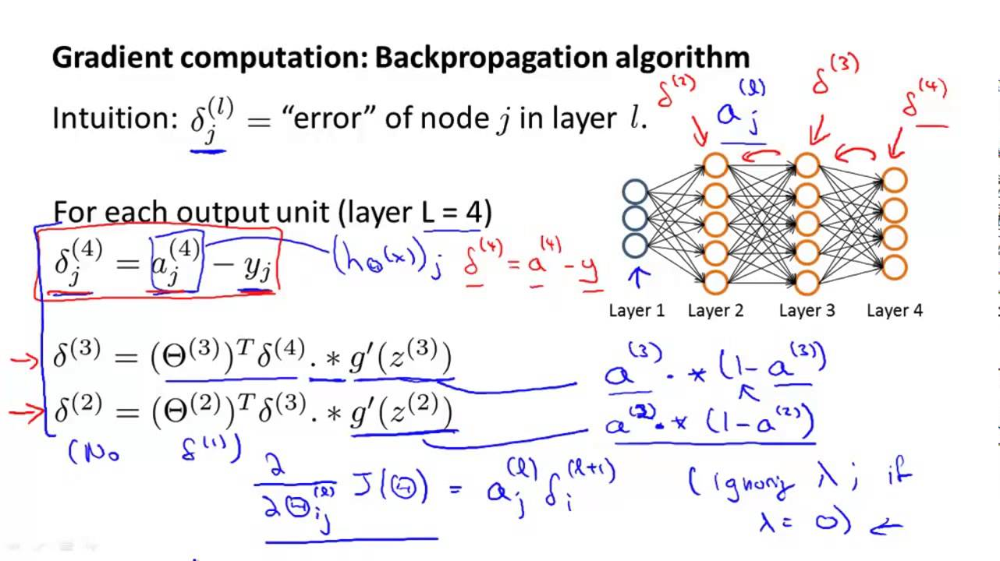
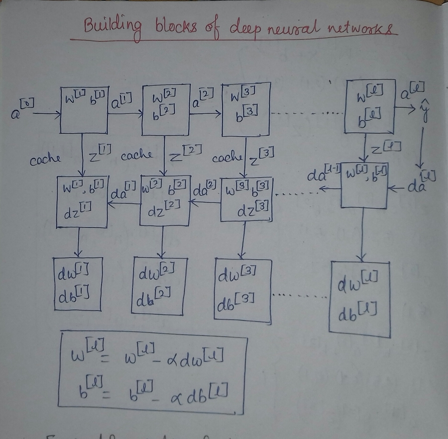

# Feed_forward_FC
Feed forward fully connected neural network from scratch.
### Dependencies :
   * Python3
   * Numpy
### Feedforward Fully connected Neural Network example :


### Forward Propagation for layer l:
 
```
 Input  a[l-1]
 Output a[l], cache(Z[l])
  Z[l] = W[l] * a[l-1] + b[l]
  a[l] = g[l]( Z[l] )
 
 Where a[l] is the activation function at layer l
 
```
### Backpropagation for layer l :


```
 Error at output layer acts as input for backprop
 Y= Label vector in training set
 g'[l](Z[l]) = Derivative of g[l](Z[l])
 Input da[l] = a[l] - Y
 Output da[l-1], dW[l], db[l]
  dZ[l] = da[l] * g'[l](Z[l])
  dW[l] = dZ[l] * a[l-1]
  db[l] = dZ[l]
  da[l] = W[l] * dZ[l]
  dZ[l] = W[l+1]` * dZ[l+1] * g'[l](Z[l])
  
```
### Hyperparameters :
```
  epsilon= learning rate
  #iterations
  #hidden layers l
  #hidden units h[1],h[2]...
  Choice of activation functions :
     1) Sigmoid
     2) tanh
     3) Softplus
     4) Softsign
     5) Arctan
   Regularisation
```
### Dimensions
```
l=layer number
  W[l] : (n[l], n[l-l]) 
  b[l] : (n[l], 1) 
 dW[l] : (n[l], n[l-1])
 db[l] : (n[l], 1)
  a[l] : g[l](Z[l])
```

# Pipeline

